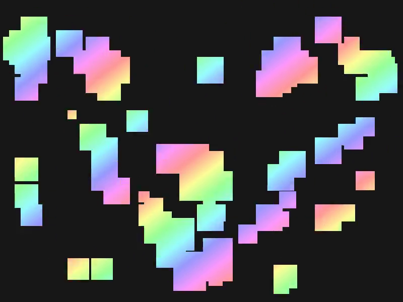

# 2mpeg4yuv



Simple playground project to explore the [YUV4MPEG2](https://wiki.multimedia.cx/index.php?title=YUV4MPEG2) format.

## Quick Start

Install the [Rust Compiler](https://www.rust-lang.org/)

> [!IMPORTANT]
> Make sure to always build with the `--release`, because the default Rust build is offensively slow.

### Preview

```console
$ cargo run --release -- preview
```

> [!WARNING]
> The preview may potentially produce loud clipping sounds!

> [!IMPORTANT]
> The preview currently works only on Linux, but feel free to contribute support for more platforms.

### Render

```console
$ cargo run --release -- render
$ mpv output.mp4
```

> [!WARNING]
> The render generates files up to 1.3GB! Make sure you have enough disk space.
